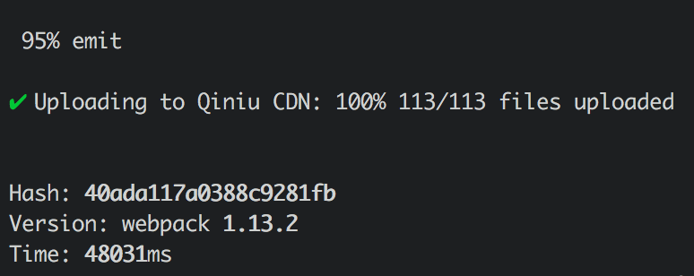

Qiniu Webpack Plugin
====================

> 上传 Webpack Assets 至 七牛 CDN

## 安装

```sh
npm install qn-webpack --save-dev
```

## 使用方法

支持的配置项:

+ `accessKey` 七牛 AccessKey
+ `secretKey` 七牛 SecretKey
+ `bucket` 七牛存储对象名称
+ `autoZone` 是否自动选择上传域名节点, 默认为 `true`
+ `path` 存储路径, 默认为 `[hash]`, 也可以指定 hash 长度, 如: `[hash:8]`
+ `exclude` 排除特定文件, 正则表达式, 如: `/index\.html$/`

***注: Webpack 的 `output.publicPath` 要指向七牛云（或自定义的）域名地址***

```js
// 引入
const QiniuPlugin = require('qn-webpack');

// 配置 Plugin
const qiniuPlugin = new QiniuPlugin({
  accessKey: 'my-access-key',
  secretKey: 'my-secret-key',
  bucket: 'my-bucket',
  path: '[hash]/'
});

// Webpack 的配置
module.exports = {
 output: {
    // 此处为七牛提供的域名(http://7xqhak.com1.z0.glb.clouddn.com) 加上 path([hash]/)
    publicPath: "http://7xqhak.com1.z0.glb.clouddn.com/[hash]/"
    // ...
 },
 plugins: [
   qiniuPlugin
   // ...
 ]
 // ...
}
```

## 效果图

无图无真相 ^\_\^



## License

(The MIT License)

Copyright (c) 2016 Felix Liu

Permission is hereby granted, free of charge, to any person obtaining a copy
of this software and associated documentation files (the "Software"), to deal
in the Software without restriction, including without limitation the rights
to use, copy, modify, merge, publish, distribute, sublicense, and/or sell
copies of the Software, and to permit persons to whom the Software is
furnished to do so, subject to the following conditions:

The above copyright notice and this permission notice shall be included in all
copies or substantial portions of the Software.

THE SOFTWARE IS PROVIDED "AS IS", WITHOUT WARRANTY OF ANY KIND, EXPRESS OR
IMPLIED, INCLUDING BUT NOT LIMITED TO THE WARRANTIES OF MERCHANTABILITY,
FITNESS FOR A PARTICULAR PURPOSE AND NONINFRINGEMENT. IN NO EVENT SHALL THE
AUTHORS OR COPYRIGHT HOLDERS BE LIABLE FOR ANY CLAIM, DAMAGES OR OTHER
LIABILITY, WHETHER IN AN ACTION OF CONTRACT, TORT OR OTHERWISE, ARISING FROM,
OUT OF OR IN CONNECTION WITH THE SOFTWARE OR THE USE OR OTHER DEALINGS IN THE
SOFTWARE.
